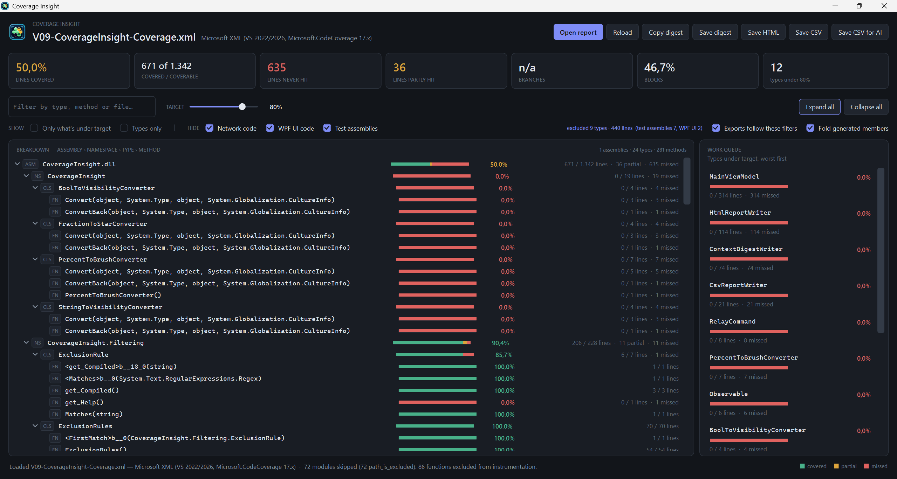
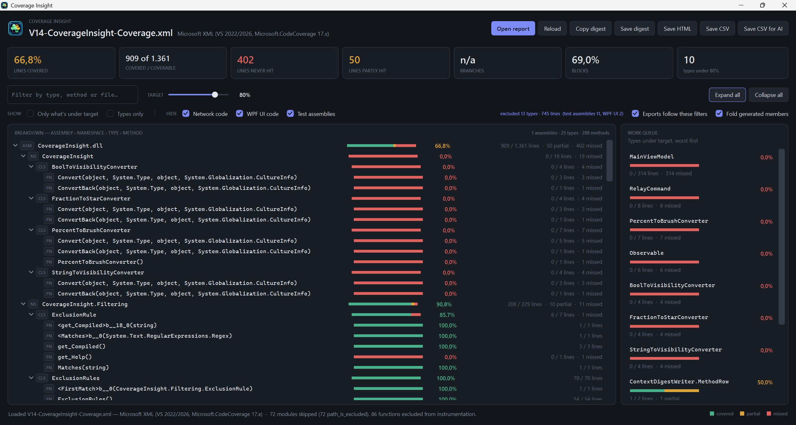

# Coverage Insight

Reads a .NET code coverage report and turns it into a work list: what is untested, ordered
by what it would cost you to leave untested. Excludes the code you never intended to test
so the headline percentage means something. Exports a compact, AI-friendly CSV to hand to a
model that is about to write the tests.

**It ranks and reports; it does not write tests or change your code.**



*Coverage Insight pointed at its own coverage report. The work queue on the right is ordered
by what is missing, not by percentage — so a forty-line gap outranks a four-line converter
sitting at 0%.*

## Why this exists

When I start a new project with AI, it's first an idea and the question "can this even be
done?" Then a few turns back and forth, and something genuinely useful comes out. Now I
realize I want to keep it — but I have zero tests for it. So the churn begins: sifting
through code coverage reports to cover what I care about. The problem is always that one
pure number, a percentage, and it's meaningless — especially when a network stack and a UI
are involved.

And keeping it means expanding it. Expanding it means refactoring first, and refactoring
without tests is risky and painful — you move something, and nothing tells you what you
broke.

What anyone should care about first is covering the unique code — not proving that the
network stack or the UI works, which in this case means WPF. Instead you see hours spent
proving the wrong thing, while the code that makes the app unique is neglected in the chase
for a number.

It gets worse once you bring AI in, because AI will serve your ill-informed goal perfectly.
Prompt it with "bring my test coverage up to 70%" and it can do that — but you've asked for
a giant waste of tokens that covers the least relevant portion of your code, and you'll get
exactly what you asked for.

My approach is to test what matters: the code where a silent drift goes unnoticed in a
refactor — the kind that returns a plausible wrong answer instead of failing, so nothing
throws and nothing is logged. Not to prove that a button clicks.

And if you want to waste tokens and CPU cycles, you can hand the full report to an AI and
let it sift. You can task it far better by compressing the information down to what matters.

This app exists to do exactly that: cut the coverage report down to what matters, and give
an AI-friendly format to work the needed test cases from. You also get a visual work list,
so you can prioritize better.

The screenshot at the top is this tool pointed at itself before I wrote the tests it
recommended. Here it is after:



*50% to 66.8%, with `MainViewModel`'s 314 lines of dialogs and clipboard calls still
deliberately untested at the top of the queue. That gap is the point: the number went up
because the code that matters got covered, not because the number was the goal.*

## What this does and doesn't do

**It does:**

- Read the three coverage XML formats a .NET project actually produces, and say which one it found.
- Roll totals up from the leaves, keeping partially covered lines as their own category rather than rounding them away.
- Drop whole categories of code — test assemblies, UI, network — from the **totals**, not just from the display, so the percentage describes the code you meant to test.
- Rank what is left by lines missed, weighted by how silently that code fails.
- Export a compact CSV for a model, a standalone HTML report for a human, and a full CSV for a spreadsheet.

**It does not:**

- Read the binary `.coverage` file. It is not XML; the app tells you the conversion command instead.
- Judge whether a type is worth testing. The exclusion and role rules are naming heuristics, they will be wrong about your codebase somewhere, and they are one editable file each.
- Write tests, run tests, or modify anything in your project. It only reads a report.
- Work on anything but Windows. It is a WPF app.

## Download

Grab the latest zip from [Releases](../../releases). It contains a single self-contained
`CoverageInsight.exe` — no .NET install required.

The binary is built by GitHub Actions from the tagged commit and carries a build provenance
attestation, so you don't have to take my word for where it came from:

```
gh attestation verify CoverageInsight.exe --repo sascha-codeforfun/CoverageInsight
```

A `.sha256` file sits beside the zip if you prefer to check that instead.

Windows SmartScreen will likely warn on first run, since the exe is unsigned. *More info →
Run anyway*, or verify the attestation above first.

## How to use it

1. Produce a coverage XML. In Visual Studio: run your tests, then **Code Coverage Results →
   Export Results** and pick the XML format. From the CLI:
   `dotnet test --collect "Code Coverage;Format=xml"`.
2. Open it in Coverage Insight — the **Open report** button, drag and drop, or as a command
   line argument.
3. Tick the **HIDE** filters for the code you do not intend to test. The headline percentage
   and the work queue both re-compute; the label to the right states exactly what was removed.
4. Read the work queue, worst first. Double-click a row — in the tree or the queue — to open
   its source file in the Visual Studio instance you already have open. Or hit **Save CSV for
   AI** and hand that to a model.

## Input formats

| Format | Root element | Where it comes from |
| --- | --- | --- |
| Microsoft XML | `<results>` | VS 2022/2026 and Microsoft.CodeCoverage 17.x |
| Visual Studio (legacy) | `<CoverageDSPriv>` | `CodeCoverage.exe analyze`, older `dotnet-coverage merge -f xml` |
| Cobertura | `<coverage>` | coverlet, i.e. `dotnet test --collect:"XPlat Code Coverage"` |

The binary `.coverage` file is not XML. Convert it first:

```
dotnet tool install --global dotnet-coverage
dotnet-coverage merge -o report.xml -f xml TestResults\**\*.coverage
```

All three parsers match element and attribute names case-insensitively and ignore XML
namespaces, so minor tooling differences do not break them. `sample-report-vs2026.xml` and
`sample-report.coveragexml` are in the repo so you can try either without running a build.

## Narrowing the scope

Four toggles under **HIDE** drop categories of code out of the totals:

- **Test assemblies** *(on by default)* — a test project's own coverage is near-total by
  construction, and summing it in pulls the headline toward the tests rather than the code
  under test.
- **WPF UI code** — windows, views, code-behind, XAML-generated partials. ViewModels are
  deliberately kept: in a WPF app they are usually the most valuable thing to test. Value
  converters are kept too.
- **Network code** — HTTP and socket clients, transports, gateways, generated service
  references. This code has runtime signal; a fetch that fails is visible without a test.
- **Generated code** *(on by default)* — source generators, designers, resource and settings
  classes. Testing it means testing someone else's generator, and on a project that leans on
  `[GeneratedRegex]` it can be a sixth of the coverable lines.

Excluded code leaves the totals entirely, and the line beside the toggles states what was
removed, so a filtered percentage is never a percentage of something unstated. The patterns
live in `Filtering/ExclusionRules.cs`, one regex per line, and each checkbox's tooltip lists
what is currently in force. Tune them — the defaults are careful about near-misses (`Review`,
`Overview` and `PreviewBuilder` are not treated as views), but only you know what your
namespaces mean.

## Exports

| Button | Produces | For |
| --- | --- | --- |
| Save CSV for AI | one row per method below 100%, ranked, with the line numbers that never ran | a model about to write tests |
| Copy / Save digest | a compact markdown summary with a token estimate | pasting into a chat |
| Save HTML | a standalone report, no CDN, prints cleanly | a human, or a build artifact |
| Save CSV | one row per node with every counter | a spreadsheet or a build gate |

The AI CSV is the one that had a consumer write acceptance checks against it. Its schema:

```
ns,type,method,lines_covered,lines_missed,lines_partial,missed_ranges,role,rank,generated
```

`missed_ranges` collapses to `118-121;129-139` — the one thing a percentage cannot tell you.
Compiler-generated members are folded into the method that declared them, so an async body
whose uncovered lines are spread across a dozen generated members reports as one row instead
of hiding below the ranking. Header lines record which filters were applied and the totals
before and after, so a method missing from the file reads as "fully covered" rather than "a
filter ate it".

## Build from source

Requires the .NET 10 SDK on Windows.

```
dotnet run --project CoverageInsight
dotnet test
```

The app itself has no NuGet dependencies, so it restores and builds offline. The test project
uses xUnit.

`dotnet build -c Export` packages the source as a zip for handing to a model, excluding build
output and any reports the app has produced.

## License

MIT.
